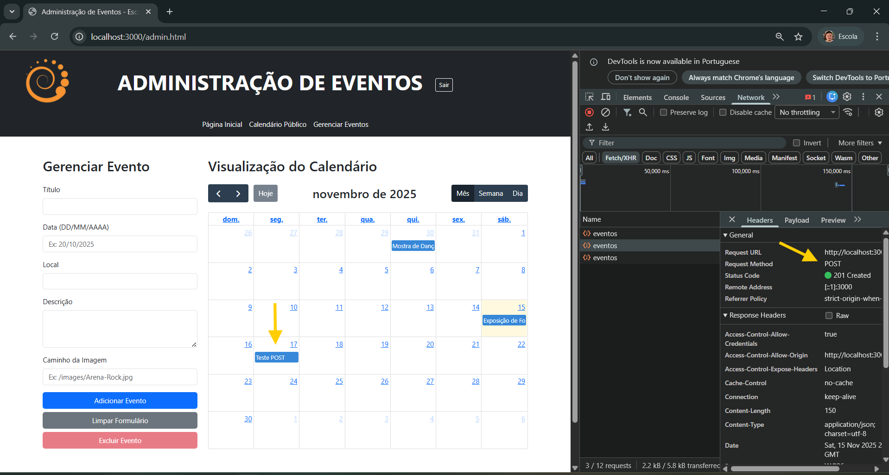
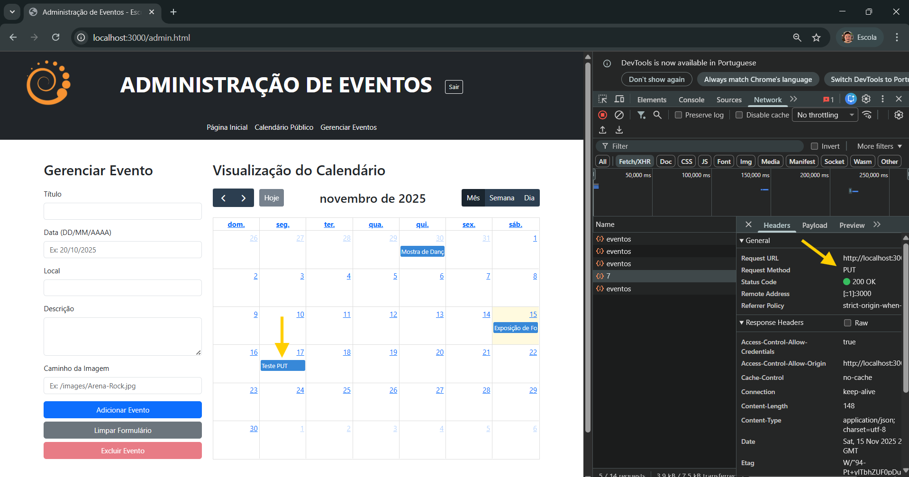
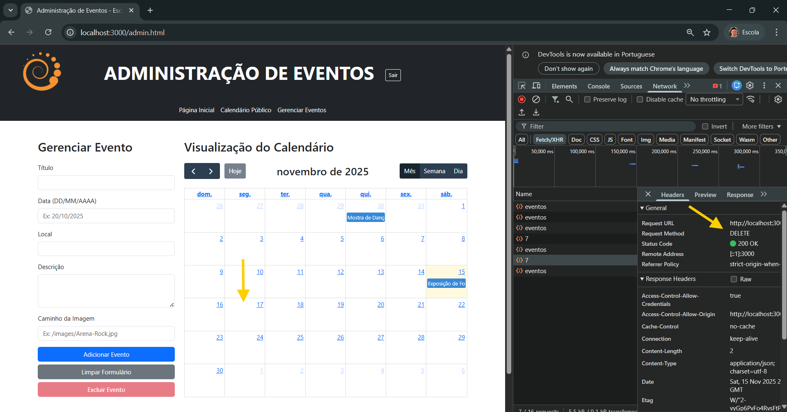

# Trabalho Prático 07 - Semanas 13 e 14

A partir dos dados cadastrados na etapa anterior, vamos trabalhar formas de apresentação que representem de forma clara e interativa as informações do seu projeto. Você poderá usar gráficos (barra, linha, pizza), mapas, calendários ou outras formas de visualização. Seu desafio é entregar uma página Web que organize, processe e exiba os dados de forma compreensível e esteticamente agradável.

Com base nos tipos de projetos escohidos, você deve propor **visualizações que estimulem a interpretação, agrupamento e exibição criativa dos dados**, trabalhando tanto a lógica quanto o design da aplicação.

Sugerimos o uso das seguintes ferramentas acessíveis: [FullCalendar](https://fullcalendar.io/), [Chart.js](https://www.chartjs.org/), [Mapbox](https://docs.mapbox.com/api/), para citar algumas.

## Informações do trabalho

- Nome: Rafael Vasconcelos de Assis
- Matricula: 898374
- Proposta de projeto escolhida: Organizações e Equipes
- Breve descrição sobre seu projeto: Este projeto consiste no desenvolvimento de uma aplicação web para a Escola Livre de Artes – Arena da Cultura, com o objetivo de tornar mais acessíveis as informações sobre a escola, cursos, oficinas e eventos da instituição.

**Print da tela com a implementação**

Nesta etapa, o projeto foi aprimorado de forma a incluir a exibição de um calendário através da API FullCalendar, no qual passa a mostrar os eventos da Escola Livre de Artes em um calendário. Uma página de gerenciamento dos eventos foi implementada para que os dados possam ser inseridos e manipulados no servidor através do cliente. Alerts foram inseridos nas páginas de login e calendário com o único propósito de guiar a navegaçaõ do apreciador do projeto, em uma eventual versão final e comercial, tais alertas não ocorreriam. Com os recursos implantados, tornou-se possóvel toda a manipulação de CRUD do calendário. Ao inserir um evento na tela de gerenciamento, este passa a constar no calendário e também passa a ser listado na página inicial (index.html), em cards que agoram são carregados de forma ordenada, do evento mais próximo para o evento mais distânte. Os datos inseridos também podem ser visualizados na página de detalhes, seja pelo acionamento na página index.html, seja pelo acionamento na página calendario.html

